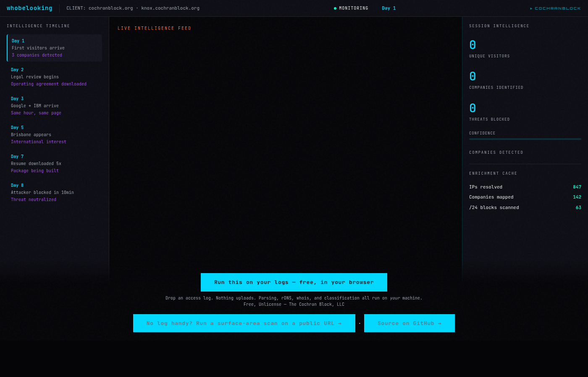
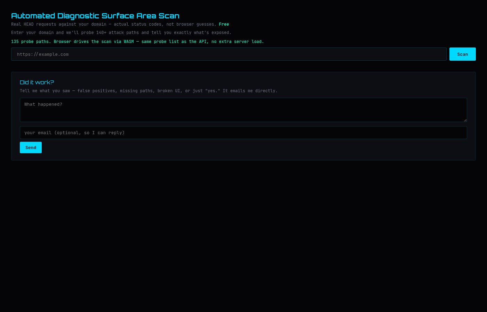
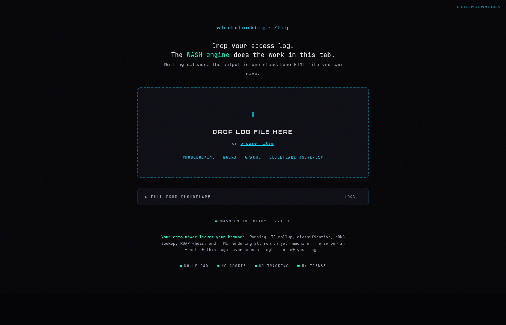
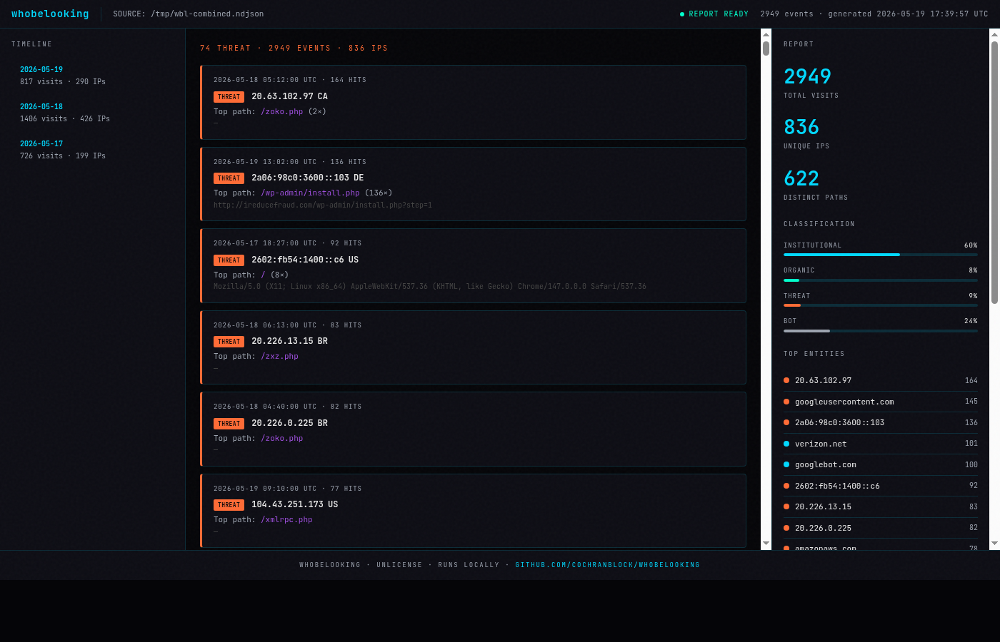

# Proof of Artifacts — whobelooking

All Rights Reserved — The Cochran Block, LLC

Every claim below is verifiable via the listed evidence.

## What This Does

You give yourself traffic data (Cloudflare logs, access logs, CSV). The tool tells you which companies are silently evaluating your site, which pages they read, how long they stayed, and whether they're a threat or an opportunity.

Real example: cochranblock.org caught Microsoft evaluating it across 14 IPs and 4 network ranges over 8 consecutive days. They downloaded the resume 5 times. The initial discovery traced to a LinkedIn post — same hour, same page, zero lag. Total marketing spend: $0.

## Architecture

```
INPUT (any source)          PIPELINE                        OUTPUT
─────────────────          ──────────                       ──────
Cloudflare API  ─┐
Access logs     ─┤         IP + path + timestamp
CSV / JSON      ─┘─────►  → rDNS batch                     HTML report (WASM, in-browser)
                           → RDAP whois                      + surface scan (135 probes, WASM)
                           → company identification          + threat classification
                           → redb enrichment cache           + SIEM ingest
                           → manual review by operator
```

### The Enrichment Flywheel

Every report caches rDNS, whois, and company ID results in sled. Customer #1's Microsoft identification helps Customer #50's report resolve instantly. The more sites in the system, the better every report gets. The data compounds. That's the moat.

### In-Browser Privacy Model

`/try` and `/scan` run entirely in the browser via WebAssembly. Customer logs never leave the customer's machine. No server-side data handling for the core analysis path.

## Screenshots

### Landing Page (`/`)


### Surface-Area Scanner (`/scan`)


### Log Analyzer (`/try`)


### HTML Intelligence Report (`whobelooking render`)


## Modules

| Module | Purpose |
|--------|---------|
| `cf` | Cloudflare GraphQL pull → visitor IPs |
| `dns` | rDNS batch + /24 neighbor scanning |
| `report` | Full pipeline: pull → rDNS → scan → output |
| `scout` | Federal contract intelligence (8 APIs) |
| `queue` | sled-backed job queue |
| `web` | axum server (whobelooking.cochranblock.org) |
| `web::scan` | Surface-area scanner — WASM probe list, browser fan-out via `/api/probe` |
| `web::try_page` | In-browser log analysis (WASM) |
| `web::openapi` | OpenAPI spec + Swagger UI + Claude skill |
| `wbl-detect` | WASM crate: parse → classify → enrich → render |
| `wbl-detect::probes` | Canonical 135-probe list (single source of truth) |
| `ctos` | CTO OSINT (HN, GitHub, Reddit, YC, Podcasts) |

## CLI Commands

```
whobelooking serve              # start web server
whobelooking queue              # list all jobs
whobelooking pop                # take next pending job
whobelooking done {id}          # mark complete
whobelooking deliver {id}       # mark delivered
whobelooking report ...         # run enrichment pipeline
whobelooking render <file>      # log file → rDNS-enriched standalone HTML report
whobelooking tail <file>        # watch log file, re-render HTML on each change (--interval, cached rDNS)
whobelooking install            # write ~/.config/systemd/user/whobelooking.service + print enable steps
whobelooking scout ...          # federal contract search
```

## Build

```
cargo build --features serve                          # with web server
cargo build --profile diamond --features serve        # production
cargo run --bin whobelooking-test --features tests,serve  # CI gate
wasm-pack build crates/wbl-detect --target web --out-dir ../../static/detect  # WASM
```

Features: `serve` (axum web), `browser` (headless Chrome), `tests` (Triple Sims), `otel` (OpenTelemetry).

## Deploy

Gemini Man pattern — copy binary, run it, old process dies automatically via PID lockfile.

```
whobelooking serve --port 8082
```

Registers with approuter. Cloudflare tunnel routes traffic.

## Binary

| Artifact | Evidence |
|----------|----------|
| Diamond binary | `target/diamond/whobelooking` — 9.7 MB, opt-level 3, fat LTO, codegen-units 1, stripped, panic=abort |
| WASM bundle | `static/detect/wbl_detect_bg.wasm` — 219 KB, wasm-opt release |
| Single binary | Serves: web frontend, CLI, queue management, CF pull, rDNS, /24 scan, federal scout, CTO OSINT |
| Zero cloud | No AWS, no Docker, no Kubernetes, no external database. sled embedded KV. |
| Gemini Man | PID lockfile at `~/.local/share/whobelooking/pid` — SIGTERM → 5s wait → SIGKILL fallback |

## Live Deployment

| Artifact | Evidence |
|----------|----------|
| whobelooking.cochranblock.org | Live — 200 OK |
| Cloudflare tunnel | DNS CNAME → cfargotunnel.com → approuter → whobelooking:8082 |
| Legacy redirects | whobelooking.org / whobelooking.com → cochranblock.org subdomain |

## Tests

| Artifact | Evidence |
|----------|----------|
| Test binary | `cargo run --bin whobelooking-test --features tests,serve` |
| 269 unit tests | wbl-detect parsers (log formats, classification, enrichment, report rendering, pcap/hex-dump), scan API, web content, security, legal |
| 8 smoke tests | Stage 5 end-to-end: `/health`, `/try` CF panel, `/api/cf/pull` validation — require live server at `WBL_SMOKE_URL` |
| Triple Sims | 3 passes, all 269 produce identical results — determinism gate |
| 14/14 standards gate | clippy, fmt, audit, deny, msrv, unsafe, docs, changelog, license, test\_binary, allow\_unused, error\_handling, secrets, cargo\_meta |
| `cargo_meta` coverage | `description`, `license`, `repository`, `documentation` (`cochranblock.github.io/whobelooking/`) all present in `Cargo.toml` |
| GitHub Pages | `cochranblock.github.io/whobelooking/` — 8-page mdbook (introduction, getting-started, CLI, log-formats, /try, CF integration, configuration, architecture); auto-deploys on push to `main` |
| Default branch | `main` |
| Actor persistence | `~/.local/share/whobelooking/actors.redb` — `actors` table; `ActorRecord {first_seen, last_seen, total_hits, total_reports, last_class}`; written/merged after every `render` run; `↩ returning` badge in HTML cards for IPs seen in prior reports |
| Multi-site combined report | `intel::render_html` — Zones column in Top-25 IPs table; Cross-Site Actors section (IPs ≥2 zones, sorted by zone count); Per-Zone Summary section (top 5 IPs per zone with hits + org) |
| Classification confidence | `f404c` in `crates/wbl-detect/src/aggregate.rs` — `(t104, u8)` return; `t105.confidence`; HTML cards show `NN%` badge per class; 4-class scoring documented in code |
| CF Firewall Block List | `intel::render_html` — `(ip.src in {...})` expression from THREAT IPs + FW-blocked IPs; per-IP reason/org/rDNS table; redacted report shows count only |
| Trend/delta view | `f452` sidebar panel — "N new IPs · M threats / N returning · M threats" when history present; hidden on zero-history; uses `history_total_reports` from `t105` |
| `#![forbid(unsafe_code)]` | `crates/wbl-detect/src/lib.rs` line 1 |

## Web Frontend / Routes

| Route | Handler | Notes |
|-------|---------|-------|
| `/` | `pages::demo` | Landing — auto-playing demo with real visitor data |
| `/about` | `pages::index` | About + live queue capacity |
| `/try` | `try_page::index` | In-browser log analysis (WASM, zero upload) |
| `/detect` | `detect::*` | Column-type detector (WASM) |
| `/scan` | `scan::index` | Surface-area scanner — 135 probes, WASM probe list, browser fan-out |
| `/api/probe` | `scan::probe` | Server HEAD relay (SSRF-guarded, rate-limited) — WASM calls this per probe |
| `/api/scan/feedback` | `feedback::submit` | Operator feedback (emails to SMTP_USER) |
| `/api/enrichment.json` | `enrichment::snapshot` | IP→org cache snapshot |
| `/openapi.json` | `openapi::*` | OpenAPI spec |
| `/docs` | `openapi::*` | Swagger UI |
| `/skill` | `openapi::skill_md` | Claude skill definition |
| `/health` | `pages::health` | Readiness check |
| `/metrics` | `metrics::endpoint` | Prometheus (token-gated, `otel` feature) |
| `/admin` | `admin::dashboard` | Order queue dashboard (token-gated) |
| `/order*` | redirect | → GitHub (order model deprecated; links preserved) |

## Probe Unification (v0.3.1)

| Claim | Evidence |
|-------|---------|
| Single source of truth | `crates/wbl-detect/src/probes.rs` — 135 entries, `pub const PROBES: &[Probe]` |
| Browser gets it via WASM | `f406 = getProbes()` exported from `wasm_api.rs`; `/scan` calls it at startup |
| Old duplication removed | JS inline array (137 entries) and Rust seed list (82 entries) both gone |
| No server-side batch scan | `/api/scan/run` removed; WASM drives scanning, `/api/probe` relays individual probes |

## SIEM / Observability

| Artifact | Evidence |
|----------|----------|
| OTEL metrics | `wbl.enrichment.snapshot.rebuilds`, `wbl.enrichment.snapshot.entries` — emitted via OTLP when `otel` feature enabled |
| Syslog ingest | RFC 3164 + RFC 5424, ELK/Logstash, Splunk KV — 8 structured log formats total |
| W3C / IIS / HAProxy ingest | W3C Extended (`#Fields:` column mapping, mid-file rotation), HAProxy TCP (IP:PORT + `{}` capture blocks) |
| AWS ALB ingest | `f436` — space-delimited fixed column order, quoted request + UA; `http`/`https`/`h2`/`ws`/`wss`/`grpc` detection |
| Azure diagnostic log ingest | `f437` — Activity Log (`callerIpAddress`), App Gateway (`clientIP`), CDN (`clientIp`); key-prefix scan finds IP at any nesting depth |
| GCP Cloud Logging ingest | `f439` — `httpRequest.remoteIp`, `requestUrl` path strip, `requestMethod`; covers Cloud Run, GCE, GKE |
| Generic JSON ingest | `f438` — last-resort: any JSON with `ip`, `remote_addr`, `remote_ip`, `client_ip`, `clientIp`, `ClientHost`, etc. — covers Caddy, Traefik, custom apps |
| Binary pcap ingest | `f454` — pcap v2.4 LE/BE, Ethernet/raw-IP/Linux SLL; IPv4 + IPv6 + TCP HTTP extraction (method/path/UA) |
| Hex dump ingest | `f455` — xxd / Wireshark / tcpdump / raw hex string auto-detected by `f400`; decoded to bytes → routed through `f454` |
| Raw IP extraction | `f435` — regex fallback on any unstructured file (ACAS/Nessus, email headers, config dumps); octets validated 0–255 |
| Visit logging | Per-request counter in sled (`visits/` tree) |
| Prometheus endpoint | `/metrics` (token-gated) |

## Airgap Configuration

| Env Var | Purpose |
|---------|---------|
| `WBL_DOH_URL` | DoH resolver for `/try` (default: Cloudflare) |
| `WBL_RDAP_BASE` | RDAP endpoint for `/try` (default: rdap.org) |
| `WBL_ENRICHMENT_URL` | Snapshot endpoint (default: /api/enrichment.json) |
| `WBL_FONTS_HREF` | Google Fonts stylesheet (empty = drop link) |
| `WBL_AIRGAP_NOTICE` | Banner text shown in `/try` for isolated networks |

CSP is computed per-request from these values — no hardcoded cross-origin fallback.

## Security

| Artifact | Evidence |
|----------|----------|
| SSRF guard | Private/loopback IPs rejected before any outbound probe (`/api/probe`) |
| Rate limiting | Probe: 7,500/min — per source IP, in-memory bucket |
| IP redaction | Demo data IPs redacted in all user-facing output |
| No secrets in output | Test scans demo for CF_TOKEN, STRIPE_KEY, API_KEY, kovakey, id_ed25519 |
| Admin token gate | `/admin` and `/metrics` require `ADMIN_TOKEN` |
| `#![forbid(unsafe_code)]` | All crate members |

## Dependencies (Cargo.toml)

| Crate | Purpose | License |
|-------|---------|---------|
| axum 0.8 | Web framework | MIT |
| reqwest 0.12 | HTTP client (rustls, no OpenSSL) | MIT/Apache-2.0 |
| tokio 1 | Async runtime | MIT |
| serde + serde_json | Serialization | MIT/Apache-2.0 |
| redb 2 | Embedded KV store | MIT |
| hickory-resolver | DNS resolution | MIT/Apache-2.0 |
| blake3 | Gate token hashing | CC0/Apache-2.0 |
| lettre | SMTP email delivery | MIT/Apache-2.0 |
| wasm-bindgen 0.2.114 | WASM ↔ JS bridge | MIT/Apache-2.0 |
| opentelemetry + otlp | Metrics export [otel] | Apache-2.0 |
| tracing + tracing-subscriber | Structured logging | MIT |
| exopack [tests] | Triple Sims + standards gate | All Rights Reserved |

## Commit History

```
git log --oneline | wc -l  →  commits since inception
git log --format="%ai" | head -1  →  latest commit
git log --format="%ai" | tail -1  →  first commit
```

<!-- COCHRANBLOCK-BRAND-FOOTER:START - generated by cochranblock/scripts/brand-stamp.sh -->

---

<sub>&#9656; **THE COCHRAN BLOCK, LLC** &#183; CAGE `1CQ66` &#183; UEI `W7X3HAQL9CF9` &#183; UNLICENSE &#183; [cochranblock.org](https://cochranblock.org)</sub>
<!-- COCHRANBLOCK-BRAND-FOOTER:END -->
