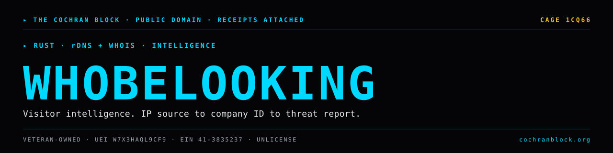

<!-- COCHRANBLOCK-BRAND-HEADER:START - generated by cochranblock/scripts/brand-stamp.sh -->
<picture>
  <source media="(prefers-color-scheme: dark)" srcset="assets/brand/banner.svg">
  <source media="(prefers-color-scheme: light)" srcset="assets/brand/banner.svg">
  
</picture>

[](https://unlicense.org)
[](https://www.rust-lang.org)
[](https://cochranblock.org)
[](https://cochranblock.org)

> &#9656; **RUST** &#183; **rDNS + WHOIS** &#183; **INTELLIGENCE**
<!-- COCHRANBLOCK-BRAND-HEADER:END -->


# whobelooking

**Visitor intelligence platform. Any IP source → rDNS → /24 scan → whois → company ID → enrichment flywheel → intelligence report.**

One binary. Zero cloud. Unlicense — public domain.

---

## Documentation

This README is the entry point. The actual docs live in two source-of-truth files at the root of the repo:

- **[PROOF_OF_ARTIFACTS.md](PROOF_OF_ARTIFACTS.md)** — what exists today, status, source-linked. Architecture, modules, CLI, build/deploy, routes, tests, dependencies, protocols. If you want to know what this project *does*, read this.
- **[TIMELINE_OF_INVENTION.md](TIMELINE_OF_INVENTION.md)** — dated, commit-level record. If you want to know how this project *got built*, read this.

---

## Run It

```
cargo build --features serve                          # with web server
cargo build --profile diamond --features serve        # production binary (6.6MB)
cargo run --bin whobelooking-test --features tests,serve  # CI gate
whobelooking serve --port 8082                        # run web server
whobelooking report ...                               # run enrichment pipeline
whobelooking scout ...                                # federal contract search
```

Full build, deploy, CLI, and route details in [PROOF_OF_ARTIFACTS.md](PROOF_OF_ARTIFACTS.md).

Try the in-browser demo: **[whobelooking.cochranblock.org/try](https://whobelooking.cochranblock.org/try)**.

---

## License

Unlicense — public domain. See [LICENSE](LICENSE). Use it, fork it, sell it, ship it inside your product, no attribution required.

Maintained by The Cochran Block, LLC · CAGE 1CQ66 · UEI W7X3HAQL9CF9 · SDVOSB Pending

Contact: mcochran@cochranblock.org · Site: https://whobelooking.cochranblock.org
<!-- COCHRANBLOCK-BRAND-FOOTER:START - generated by cochranblock/scripts/brand-stamp.sh -->

---

<sub>&#9656; **THE COCHRAN BLOCK, LLC** &#183; Veteran-Owned &#183; **CAGE** `1CQ66` &#183; **UEI** `W7X3HAQL9CF9` &#183; **EIN** `41-3835237`</sub>

<sub>&#9656; PUBLIC DOMAIN &#183; UNLICENSE &#183; RECEIPTS ATTACHED &#183; [**cochranblock.org**](https://cochranblock.org) &#183; [github.com/cochranblock](https://github.com/cochranblock)</sub>
<!-- COCHRANBLOCK-BRAND-FOOTER:END -->
